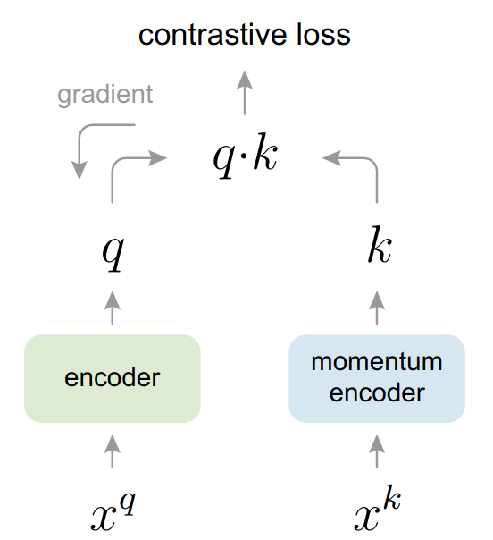
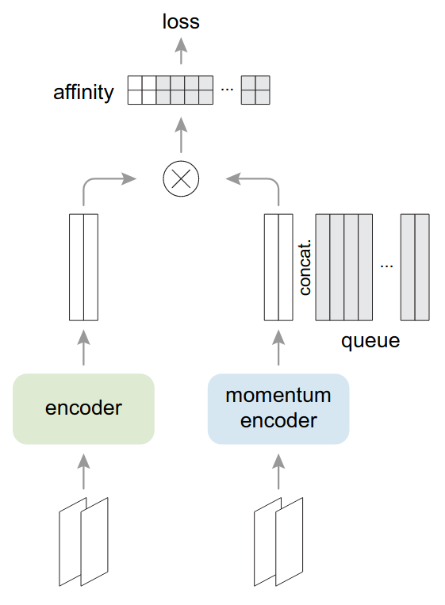
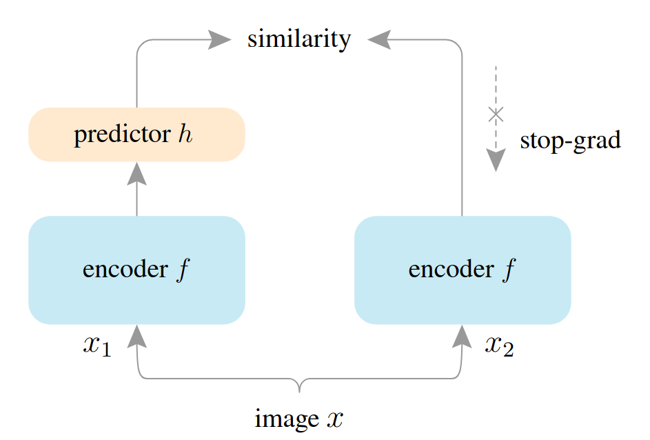

# Query Efficient Model Extraction with Self-Supervised Contrastive Learning
## Alex Mankowski
### Trustworthy Machine Learning

---

# Introduction
- Extension of *High Accuracy and High Fidelity Extraction of Neural Networks* by *Jagielski et. al* - 2020
- **Attack Model**
  - Black Box access to our target model - we can access output scores
  - We have some unlabeled dataset representative of the target's input
  - Image classification task
- **Goal:**
  - Steal a copy of the target model with high-accuracy on the target's task
  - Do this with as few queries as possible using self-supervised learning
  - Original paper used Rotation Loss, which will serve as our baseline

---

# Self-Supervised Contrastive Learning
- Use some backbone network to embed images in an embedding space
- Images belonging to the same class should be more similar than images belonging to different classes
- We do not have label access in the self-supervised scenario, so we construct some pretext task to learn good embeddings
- For contrastive learning we generate two augmentations of an input image, and try to maximize their similarity in the embedding space
- Model collapse occurs when all images are embedded to a constant point

---

<!-- footer: Momentum Contrast for Unsupervised Visual Representation Learning, He et al. - 2020 -->
# MoCo

- Each image gives two augmentations $x^q$ and $x^k$
- Both encoders share the same model architecture 
- Encoder weights ($\theta_q$) updated by standard backpropogation 
- Momentum encoder weights ($\theta_k$) updated by:
  $$ \theta_{k} \leftarrow m\theta_{k} + (1 - m)\theta_q $$
  - $m \in [0, 1)$ is a hyperparameter
---

<!-- footer: Momentum Contrast for Unsupervised Visual Representation Learning, He et al. - 2020 -->
# MoCo

- **Loss Function**
$$ \mathcal{L}_q = -log \frac{exp(q \cdot k_+ / \tau)}{\sum_{i=0}^{K}exp(q \cdot k_i / \tau)} $$
- $q$ and $k_+$ correspond to the same image (positive pair)
- Model retains a queue (length $K$) of samples, such that we can reuse the encoded samples from previous batches (negative pairs)
- $\tau$ is a temperature hyperparameter

---

<!-- footer: Exploring Simple Siamese Representation Learning by Chen et al. - 2020 -->

# SimSiam

- Now the encoders share weights
- The predictor is a two layer MLP
- **Loss Function**
$$ \mathcal{L} = \frac{1}{2}\mathcal{D}(p_1, z_2) + \frac{1}{2}\mathcal{D}(p_2, z_1) $$
$$ \mathcal{D}(p_1, z_2) = -\frac{p_1}{|| p_1 ||_2} \cdot \frac{z_2}{|| z_2 ||_2} $$
- $p$ is the predictor output, $z$ is the RHS encoder output
- Encoder never receives gradients from $z$

---

<!-- footer: '' -->

# Proposed Algorithm
1. Collect an initially unlabeled dataset (ImageNet)
2. Conduct self-supervised pretraining with the unlabeled data with our local model (ResNet-50)
3. Query the target model (ResNeXt-101) using some amount of the unlabeled data to obtain output scores
4. Add a single fully-connected classification layer to the local model (encoder for MoCo) and finetune using the target's output scores in a distillation approach
- We are interested in how the self-supervised pre-training step impacts performance versus training only with our queried data

---

# Training Specifics
- **Pretraining**
  - Follow the procedure in each method's corresponding paper
- **Finetuning for 1% and 10% Data Fractions**
  - For finetuning after pretraining follow the procedure outlined in *Prototypical Contrastive Learning of Unsupervised Representations, Li et al.*
    - 20 epochs, different classifier/ResNet learning rates
  - For finetuning without pretraining follow the procedure outlined in *S4L: Self-Supervised Semi-Supervised Learning, Zhai et al.*
    - 1000 (1%) or 200 (10%) epochs
- **100% Data Training**
  - Follow the default pytorch ImageNet training protocol
    - 90 epochs
---

# Results

Top-1/Top-5 Accuracy
Data Fraction | Supervised* | Rotation* | MoCo | SimSiam
--- | --- | --- | --- | ---
1% | 8.20/23.25 | 17.11/40.92 | **39.35/68.99** | 16.84/40.24
10% | 55.25/80.37 | 52.37/79.04 | **61.05/85.03** | 53.40/79.49
100% | 76.00/92.99 | X | **76.72/93.35** | X

\* - Baselines
- Supervised has no pre-training, we train directly on 1%/10% of the data.
- Our target model has 84.2/97.2 accuracy on ImageNet

---

# Conclusions
- We see a clear improvement over the supervised baseline and previous self-supervised work with model extraction
- We can combine self-supervised training with additional query-efficient techniques to further improve model extraction
- More specific training protocols may have to be implemented to get the most out of finetuning
- SimSiam performs better than MoCo for other tasks, however MoCo clearly outperforms it here
